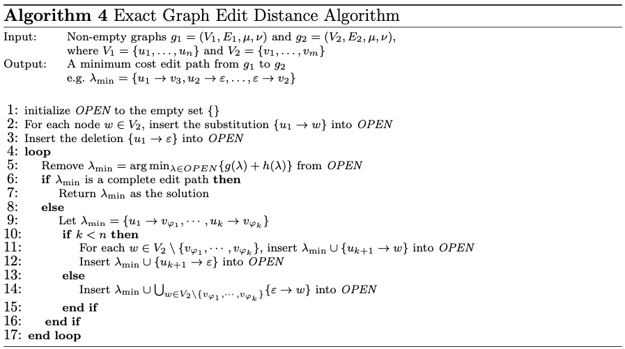

- properties
	- complete: always finds a solution if one exists
	- admissible: never overestimates the solution's cost (i.e., it always underestimates it)
	- greedy: selects locally-optimal solution/step
	- exponential complexity in the number of nodes ($\mathcal{O(m^n)}$)
		- LATER with $m < n$ / OR $n = |V_1|, m = |V_2|$
- search space is organized as an (ordered) tree, whereby inner nodes represent partial solutions and leaf nodes represent complete solutions
	- graph edit distance: inner nodes correspond to partial edit paths, leaf nodes to complete edit paths
	- search tree is constructed dynamically at runtime, whereby one node is expanded per iteration
		- structural constraints are not obeyed during construction
- select node that has lowest cost associated with it
	- cost is determined based on...
		- cost accumulated so far $g(\lambda)$
		- estimation of the cost that is necessary to complete the path $h(\lambda)$ (heuristic)
	- can be determined during selection (on the fly) or during node expansion (and stored in the node itself)
- implementation
	- 
- initialization of candidate set
	- add one candidate for every possible operation that can be performed on node $u_1$
		- substitution with any node in the target graph
		- node deletion
- expansion of candidate set/node
	- if path does not yet contain an edit operation for all nodes in the source graph
		- select one node in the source graph that is not yet part of the edit path, and add one candidate for every possible operations that can be performed on that node
			- substitution of that graph with any node in the target graph that is not yet part of the edit path
			- node deletion
	- if path already contains an edit operation for all nodes in the source graph
		- add one candidate that has all remaining nodes in the target graph added to it
- considerations of edge edit operations
	- necessity of edge edit operations is assessed whenever a new node edit operation is added to a path
	- edge edit operation is necessary if one of the nodes $u, v$ in the node edit operation $(u \rightarrow v)$ is adjacent to another node that has already been edited
- heuristic
	- needs to be admissible (i.e., must not overestimate the actual cost)
	- trade-off between precision and speed (simplest case $h(\lambda) = 0$; most complex case determines cost accurately)
	- sample heuristic
		- assumption: substitutions are generally cheaper than a deletion followed by an insertion
		- let $n_1$ and $n_2$ be number of unprocessed nodes nodes in $g_1$ and $g_2$, respectively
		- LATER for every unprocessed node in $g_1$, consider a substitution with any node from $g_2$ (test all possible combations)
			- LATER quadratic complexity?
			- LATER what about edge edit operations?
		- cost is given by $\min{\{n_1, n_2\}}$ cheapest such substitutions, and the cost of the insertion/deletion of the remaining $|n_1 - n_2|$ nodes
		- heuristic considers most optimistic way without considering the impact of one substitution on the others
			- therefore permissible
			- two edit operations might be cheap separately but may imply high cost (e.g., due to edge operation) when considered jointly
- variations
	- beam search
		- instead of expanding all successor nodes in the search tree, only a fixed number of nodes $s$ to be processed are kept the candidate set
			- option 1: limit number of nodes considered during expansion
			- option 2: limit size of candidate set (presented option)