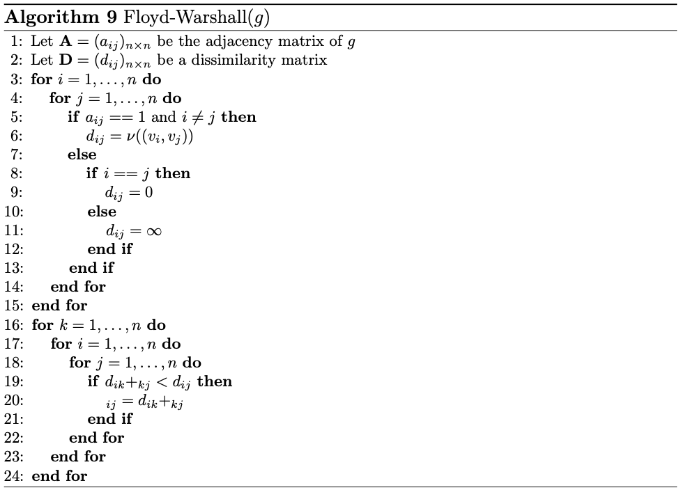
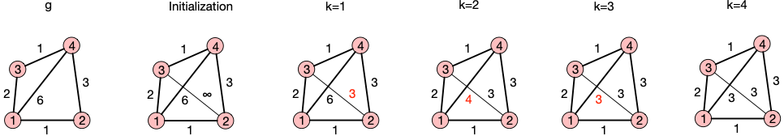

- determines shortest path between all pairs of nodes
	- as opposed to Dijkstra, which only finds shortest path from one source node to all other nodes
- based on principle of optimality
	- stipulates that if path from $v_i$ to $v_j$ through $v_k$ is optimal, then the subpaths from $v_i$ to $v_k$ and from $v_k$ to $v_j$ must also be optimal
	- algorithm iteratively adds every node as an intermediate point $v_k$ and updates the shortest paths accordingly
	- once all nodes were added as an intermediate point, we know that the remaining shortest paths considered all possible nodes
- supports negative edge weights, as long as graph does not contain negative-weighted cycles
- 
	- first part accounts for initialization of dissimilarity matrix
		- distance of one node to an adjacent node is given by label of corresponding edge
		- distance of every node to itself is zero
		- distance between any other two nodes is considered to be infinite
	- second part iteratively adds every node as an intermediate node for all paths
		- index $k$ refers to "intermediate node"
	- LATER Algorithm seems to be incomplete (only index, no entity that they're referring to)
- example
	- 
	- (current state after every outer iteration, i.e., on every update of $k$)
		- corresponds to one choice of an intermediate node