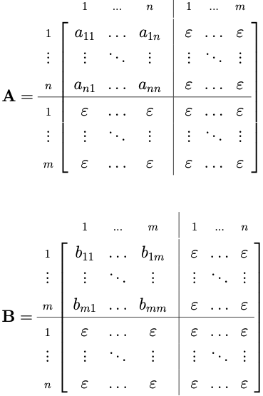
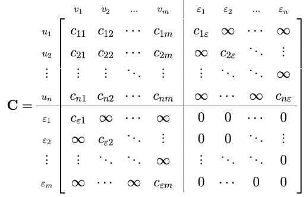

- computation of graph edit distance belongs to family of quadratic assignment problems (QAP)
- QAP in general
	- problem of assigning $n$ entities of some set $S = \{s_1, \dots, s_n\}$ to $n$ entities of some other set $Q = \{q_1, \dots, q_n\}$ under some constraints
	- assignment is typically represented using permutation $(\varphi_1, \dots, \varphi_n)$ of $[1, n]$, whereby the entity $e_1 \in S$ is mapped to entity $q_{\varphi_1} \in Q$
	- belongs to family of NP-complete problems
- reformulation as QAP
	- problems
		- requires $|S| = |Q|$ which doesn't generally hold for graphs
		- QAP only accounts for assignments/substitutions (1:1, i.e., QAP constructs bijective mapping) but graph edit distance may also contain insertions and deletions (0-2:0-2)
	- reformulation
		- add empty nodes to both graphs to ensure that they match structure
			- $g_1 = (V_1^+, E_1, \mu_1, \nu_1)$ and $g_1 = (V_2+, E_2, \mu_2, \nu_2)$
				- $n = |V_1|, m = |V_2|$
				- $V_1^+ = V_1 \cup \{\varepsilon_1, \dots, \varepsilon_m\}$ and $V_2^+ = V_2 \cup \{\varepsilon_1, \dots, \varepsilon_n\}$
			- adjacency matrices of graphs are of equal dimension
				- entry $a_{ij}$ corresponds to edge $(u_i, v_j)$ with $u_i \in V_1$ and $v_j \in V_2$ if edge exists, and empty edge $\varepsilon$ otherwise
				- 
		- construction of cost matrix
			- 
			- entry $c_{ij}$ represents cost of node substitution $(u_i \rightarrow u_j)$
				- edge edit cost is considered separately
			- structure of quadrants
				- upper left: cost of substitution of node in $g_1$ to node in $g_2$
				- upper right: deletion of node
					- only diagonal contains actual cost as every node may only be deleted once
				- lower left: insertion of node
					- only diagonal contains actual cost as every node may only be deleted once
				- lower right: no action
					- no cost in all cells as taking no action should not imply any cost
	- optimization problem
		- general case for directed graphs
			- $\argmin_{(\varphi_1, \dots, \varphi_{(n +m)}) \in S_{(n + m)}} [\sum_1^{n + m} c_{i \varphi_i} + \sum_{j = 1}^{n + m} \sum_{j = 1}^{n + m} c(a_{ij} \rightarrow b_{\varphi_i \varphi_j})]$
				- first term (linear term) accounts for cost of node edit operations
				- second term (quadratic term) accounts for cost of implied edge edit operations
					- recall that adjacency matrix contains references to edges
					- quadratic since double series is quadratic as well ([MathWorld](https://mathworld.wolfram.com/DoubleSeries.html))
			- $S_{(n + m)}$ refers to set of all $(n + m)!$ possible permutations of integers $[1, n + m]$
		- general case for undirected graphs
			- $\argmin_{(\varphi_1, \dots, \varphi_{(n +m)}) \in S_{(n + m)}} [\sum_1^{n + m} c_{i \varphi_i} + \sum_{j = 1}^{n + m} \sum_{j = i + 1}^{n + m} c(a_{ij} \rightarrow b_{\varphi_i \varphi_j})]$
				- sum in second term needs to be adjusted to avoid double-counting of edges
				- undirected graphs are represented as directed graphs with two opposed directed edges
		- permutation yielded by the optimization problem corresponds to bijective assignment from $V_1^+$ to $V_2^+$
			- corresponds to complete edit path $\lambda = \{(u_1, v_{\varphi_1}), (u_2, v_{\varphi_2}), \dots, (u_{m + n}, v_{\varphi_{m + n}})\}$ with $\lambda \in \Upsilon(g_1, g_2)$