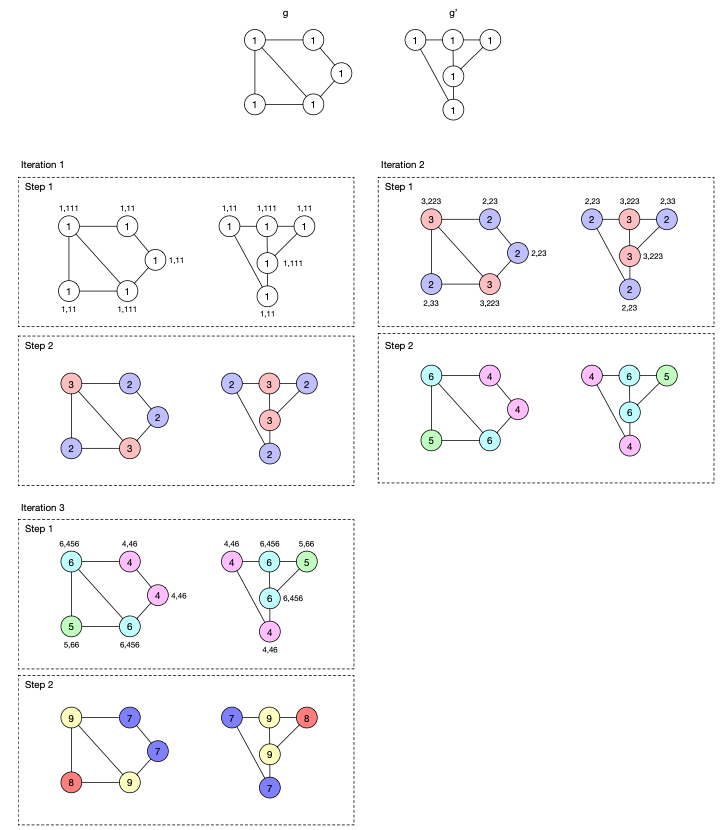

- necessary but not sufficient condition for $g \cong g'$ for any two graphs $g$, $g'$
- intuition
	- produces canonical forms of graphs for any pair of graphs
		- canonical form of a graph is a unique representation of a graph that standardizes it in such a way that every two isomorphic graphs have the same canonical form, and every two non-isomorphic graphs have different canonical forms
			- graphs can only be isomorphic if their canonical forms are equivalent
			- canonical form is a simpler mathematical representation/characterization of some object
		- **not strictly a canonical form as condition is not sufficient**
			- LATER may happen with cyclic (or regular?) structure with identical degrees
	- performs $V$ iterations, whereby the algorithm may terminate after any iteration in case the graphs are not isomorphic
		- may also terminate early as soon as the set of labels stabilized
- implementation
	- every iteration consists of two steps
		- step 1: augment every node's label with the labels of its neighbors
			- for every vertex $v$, do the following:
				- collect the labels of the neighbors into a single multiset (one element may appear more than once)
				- sort the multiset
				- turn multiset into a string and concatenate it to the node's original label
				- set $v$'s label to the newly constructed string
			- after $n$ iterations, the labels are guaranteed to be propagated throughout the entire graph
		- step 2: compress labels
			- sort union of vertex labels in $V$ and $V'$
			- assign a new (compressed) label to every distinct label in that union
				- mapping/function is injective, as $f(l_1) = f(l_2)$ if and only if $l_1 \neq l_2$
			- update the labels of all vertices in $V$ and $V'$ according to the mapping
			- check for termination criteria
				- if both graphs do not contain the same set of labels (after this reassignment), we terminate and conclude that the graphs are not isomorphic
					- that is, it must hold that $\{l_i(v) | v \in V\} \neq \{l_i (v') | v' \in V'\}$
				- if the new labels partition the set of vertices the same way as the old labels (i.e., this iteration's graph is identical to the previous iteration's one), we terminate and conclude that the graphs may be isomorphic
				- if we finished iteration $n$, we terminate and conclude that the graphs may be isomorphic
	- vertex labels can be initialized with symbols corresponding to the respective vertex' degree
- complexity
	- execution til saturation: $\mathcal{O}(hm)$
		- for every iteration $h$:
			- definition of multi set: $\mathcal{O}(m)$
			- sorting every multi set: $\mathcal{O}(m)$
				- possible using counting sort (instance of bucket sort)
			- label compression: $\mathcal{O}(m)$
- sample execution
	- 
	- terminates since the partition of the vertices after iteration 2 is equivalent to partition after iteration 3 (partition by vertex labels)