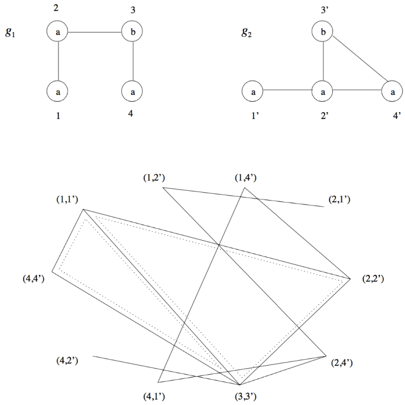

- definition
	- Let $g_1 = (V_1, E_1, \mu_1, \nu_1)$ and $g_2 = (V_2, E_2, \mu_2, \nu_2)$ two graphs. The association graph of $g_1$ and $g_2$ is an unlabeled, undirected graph $G = (V, E)$ that is defined as follows:
		- $V = \{(u_1, u_2) \in (V_1 \times V_2)| \mu_1 (u_1) = \mu_2 (u_2)\}$
			- nodes are all pairs in $V_1 \times V_2$ that contain nodes with matching labeles
			- a node in $V$ represents two vertices, one in $V_1$ and one in $V_2$
			- node can be interpreted as a mapping
		- $E$: There is an edge between the nodes $(u_1, u_2)$ and $(v_1, v_2)$ if one of the following holds:
			- $e_1 \in E_1 \wedge e_2 \in E_2 \wedge \nu_1 (e_1) = \nu (e_2)$
			- $e_1 \not\in E_1 \wedge e_2 \not\in E_2$
			- (with $e_1 = (u_1, v_1)$ and $e_2 = (u_2, v_2)$)
			- (with $u_1 \neq v_1, u_2 \neq v_2$)
			- in other words: two vertices are connected if the edges in $g_1$ and $g_2$ are consistent
	- (indices indicate graph of origin)
- example
	- 