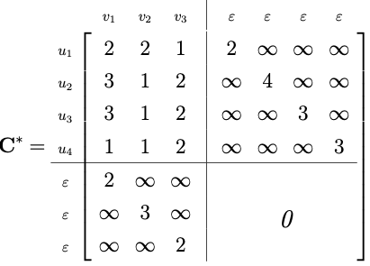

- motivation
	- approximation of [[graph edit distance]]
	- reduces graph edit distance from a quadratic assignment problem (QAP) to a linear sum assignment problem (LSAP)
- LSAPs in general
	- consider a single cost matrix without any side constraints
		- only contains a linear term
		- determines mapping between two sets of independent entities, i.e., entities that do not expose any structure
	- algorithms
		- Munkres algoritm (aka. Hungarian method)
		- Volgenant-Jonker algorithm
		- complexity of best performing exact algorithm is cubic in the size of the problem
- reformulation of problem
	- consider edge constraints (derive cost matrix)
		- LSAP does not contain quadratic term which means that structural constraints (in the form of edge edit operations) are neglected
		- include cost for edge edit operation in cells for node edit operations
			- possible approach: consider walks centered on each node
			- possible approach: consider small subgraphs around each node
			- possible approach: minimize cost of implied edit edge operations in the direct neighborhood
				- node deletion: consider true cost
					- $c_{i \varepsilon}$: cost of deletion of node $u_i$ + cost of deletion of all edges incident to $u_i$
				- node insertion: consider true cost
					- $c_{\varepsilon j}$: cost of insertion of node $v_j$ + cost of insertion of all edges incident to $v_j$
				- node substitution: approximate true cost through minimum cost of edge edit operations that the substitution implies
					- considers local but not global edge structure of graph
						- we pick locally-optimal assignment of nodes such that cost of edge edit operations is minimal (local to the considered node)
						- does not consider constraints imposed by other vertices' optima
						- empirical observation: often the optimal solution in practice, but this isn't necessarily the case
					- formally solves LSAP on in- and outgoing edges of two nodes $u_i \in V_1$ and $u_j \in V_2$
					- directed graphs
						- $c^*_{ij} = c_{ij} + \min_{(\varphi_1, \dots, \varphi_{(n +m)}) \in S_{(n + m)}}{\sum_{k = 1}^{n + m}{(c(a_{ik} \rightarrow b_{j\varphi_k}) + c(a_{ki} \rightarrow b_{\varphi_k j}))}}$
					- undirected graphs
						- $c^*_{ij} = c_{ij} + \min_{(\varphi_1, \dots, \varphi_{(n +m)}) \in S_{(n + m)}}{\sum_{k = 1}^{n + m}{c(a_{ik} \rightarrow b_{j\varphi_k})}}$
					- easy to calculate if unlabeled, as cost directly related to the difference of the number of edges
			- yields cost matrix of the following form
				- 
				- (matches form of cost matrix for QAP)
	- optimization problem
		- general case for directed and undirected graphs
			- $\argmin_{(\varphi_1, \dots, \varphi_{(n +m)}) \in S_{(n + m)}} \sum_1^{n + m} c_{i \varphi_i}^*$
			- we already made the distinction between directed and undirected graphs when determining the adjusted cost matrix
			- $S_{(n + m)}$ refers to set of all $(n + m)!$ possible permutations of integers $[1, n + m]$
		- permutation yielded by the optimization problem corresponds to bijective assignment from $V_1^+$ to $V_2^+$
			- corresponds to complete edit path $\lambda = \{(u_1, v_{\varphi_1}), (u_2, v_{\varphi_2}), \dots, (u_{m + n}, v_{\varphi_{m + n}})\}$ with $\lambda \in \Upsilon(g_1, g_2)$
	- determining true cost of optimal solution
		- derive set of edge edit operations implied by optimized edit path
			- only considered local edge structure during optimization
			- actual edge edit operations follows from global edge structure, which is now considered in isolation/separately from the optimization problem
		- calculate true cost of edit path
			- directed graphs: $d_\psi (g_1, g_2) = \sum_{i = 1}^{n + m} c_{i \varphi_i^*} + \sum_{i = 1}^{n + m} \sum_{j = 1}^{n + m} c(a_{ij} \rightarrow b_{\varphi_i \varphi_j})$
				- linear term: cost of node edit operations (taken from original cost matrix, not adjusted cost matrix)
				- quadratic term: cost of edge edit operations
			- undirected graphs: $d_\psi (g_1, g_2) = \sum_{i = 1}^{n + m} c_{i \varphi_i^*} + \sum_{i = 1}^{n + m} \sum_{j = 1}^{n + m} \frac{1}{2} c(a_{ij} \rightarrow b_{\varphi_i \varphi_j})$
			-