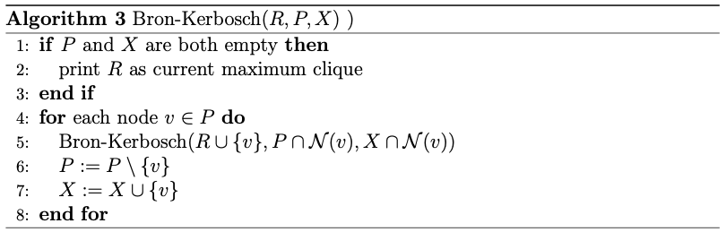
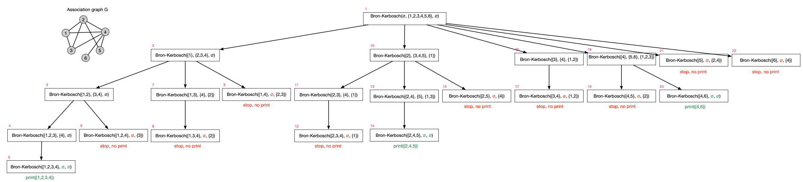

- intuition
	- clique can be found by starting with some node and then expanding to include its neighbors
	- clique can be expanded as long as all vertices in set are all connected to each other
- implementation
	- recursive function taking three arguments
		- $R$: current clique (under construction)
		- $P$: potential candidates, i.e., set of nodes that are connected to all nodes in $R$
		- $X$: discarded past candidates, i.e., set of nodes that are not part of a maximal clique
	- first call: $P = \emptyset, P = V, X = \emptyset$
	- recursion unwinds as soon as $P$ and $X$ are empty
		- does not cause caller to terminate early
			- algorithm always searches complete tree
		- if candidate set is empty but exclusion set isn't, we know that there's some other path that already found that clique
	- recursive calls take intersection of $P$ and $X$ with $\mathcal{N}(v)$
		- eliminates all candidates that are not adjacent to the current candidate
			- candidate set at recursion level $x$ only contains nodes that are adjacent to all nodes that were selected at recursion levels smaller than $x$
	- pseudo code
		- 
- variants
	- Bron-Kerbosch with pivot mode
		- selects a pivot node $u \in P \cup X$ in every recursive invocation
			- typically node of highest degree
			- intuition: if strongly connected node is not processed right away, it will be processed when processing its neighbors
			- correctness: maximal clique that may be found in tests of neighbors of $u$ would also be found when testing $u$ or any of its non-neighbors, since at least one of them will always be part of that maximal clique
		- complexity of $\mathcal{O}(3^{n / 3})$ with $n = |g|$
- complexity
	- other algorithms have better worst-case complexity but are found to run less efficiently in practice
- sample execution
	- 