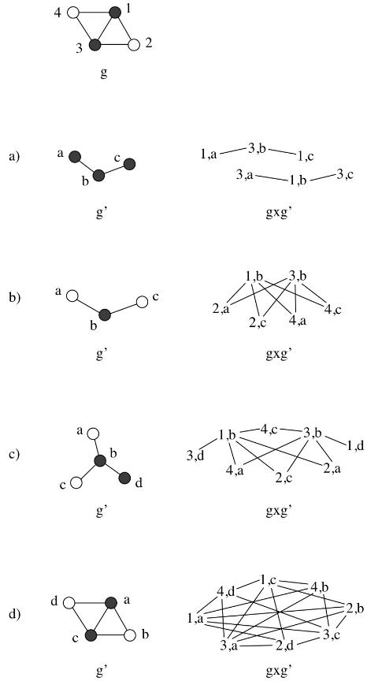

- definition
	- the direct product of two graphs $g = (V, E, \mu, \nu)$ and $g' = (V', E', \mu', \nu')$ is the graph $(g \times g') = (V_\times, E_\times, \mu_\times, \nu_\times)$ defined by
		- $V_\times = \{(u, u') \in V \times V' | \mu(u) = \mu'(u') \}$
			- nodes are all pairs in $V \times V'$ that contain nodes with matching labels
			- a node in $V_\times$ represents two vertices, one in $V$ and one in $V'$
			- node can be represented as a mapping
		- $E_\times$: There is an edge between the nodes $(u, u')$ and $(v, v')$ if the following holds:
			- $e \in E \wedge e' \in E' \wedge \nu(e) = \nu(e')$
			- (with $e = (u, v)$ and $e' = (u', v')$)
			- (with $u \neq v, u' \neq v'$)
	- labeling functions of direct product are defined according to the nodes that a single node in $V_\times$ aggregates
		- $\mu_\times (u, u') = \mu(u) = \mu'(u')$
		- $\nu_\times ((u, u'), (v, v')) = \nu(u, v) = \nu' (u', v')$
	- direct product graph identifies compatible nodes and edges in two graphs, by definition
- adjacency matrix
	- adjacency matrix typically defined according to "indicator function"
		- cell value is $1$ if corresponding edge exists, and $0$ otherwise
	- entry $a_{ij}$ in $A_\times^n$ refers to number of identical walks of length $n$ in both base graphs between the base nodes represented by the product graph $i$th and $j$th nodes
- bounds
	- number of nodes is bounded by $n^2$ where $n = \max(|V|, |V'|)$
- related to [[association graph]]s but not equal
	- in association graphs, two nodes are adjacent if the connectivity of the base nodes is consistent in both base graphs
		- i.e., nodes are consistently connected or disconnected in both base graphs
	- direct product graphs require nodes to be connected in both base graphs
		- i.e., association graphs have two conditions upon which nodes are connected, whereas direct product graphs only have one
- example
	- 
-