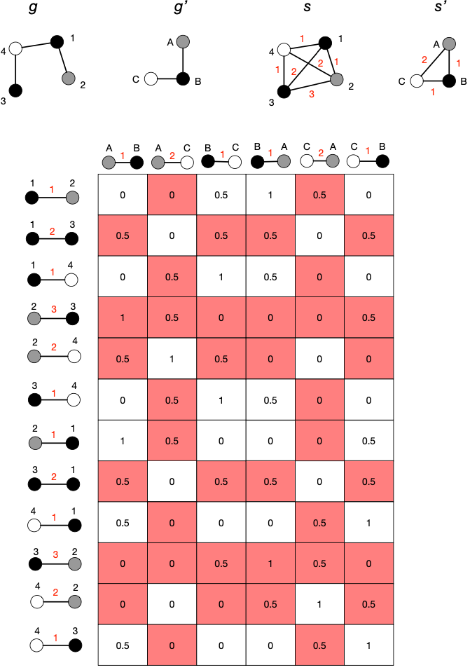

- motivation
	- [[shortest path graph kernel]] has runtime complexity of $\mathcal{O}(n^4)$
- intuition
	- extend [[shortest path graph kernel]] with an additional factor $\kappa_{\text{steps}}$ that is zero in case two paths don't match
	- reduces number of evaluations of $\kappa_{\text{path}^{(1)}}$, which is typically composed of three kernel functions
- definition
	- Let $g_1$ and $g_2$ be two graphs that are Floyd-transformed into $s_1 = (V_1, E_1)$ and $s_2 = (V_2, E_2)$ (i.e., $s_1$ and $s_2$ are shortest-paths graphs). We define the equal length shortest-path graph kernel by
	  $$
	  \kappa_{ELP}(s_1, s_2) = \sum_{(u, v) \in E_1} \sum_{(u', v') \in E_2} \kappa_{\text{path}^{(1)}} ((u, v), (u', v')) \bullet \kappa_{\text{steps}}((u, v), (u', v'))
	  $$
	- we define $\kappa_{\text{steps}}$ such that it is zero for all pairs of shortest pairs where number of edges don't match, and one otherwise:
	  $$
	  \kappa_{\text{steps}}((u, v), (u', v')) = \begin{cases}
	  1 & \text{if steps}(u, v) = \text{steps}(u', v') \\
	  0 & \text{otherwise}
	  \end{cases}
	  $$
- example
	- 
		- cells denote similarities $\kappa_{\text{path}^{(1)}}$
		- cell has red backdrop if its value is discarded in the final value (since $\kappa_{\text{steps}}$ is zero)
	- cost function is defined as
	  $$
	  \kappa_{\text{path}^{(1)}} ((u, v), (u', v')) = \begin{cases}
	  1 & \text{if } \mu(u) = \mu(u') \text{ and } \mu(v) = \mu(v') \\
	  0.5 & \text{if } \mu(u) = \mu(u') \text{ xor } \mu(v) = \mu(v')\\
	  0 & \text{otherwise}
	  \end{cases}
	  $$