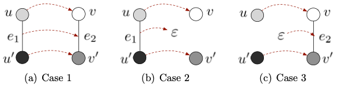
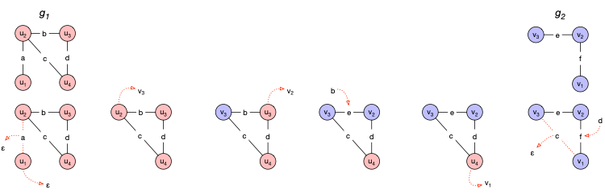

- motivation
	- constraints for graph matchings may be too rigid to properly indicate similarity
		- even maximum common subgraphs require large parts of the graphs to be isomorphic for graphs to be deemed similar
- general properties
	- graph edit distance is an inexact/error-tolerant graph matching technique
	- graph edit distances are a special type of [[edit distance]]s
	- can be tailored to use cases by adjusting cost functions (as in the different costs for different kinds of deviations in string edit distances)
- edit path
	- A complete edit path $\lambda(g_1, g_2)$ between two graphs $g_1$ and $g_2$ is a set $\{e_1, \dots, e_k\}$ of $k$ edit operations $e_i$ that transform $g_1$ completely into $g_2$
	- A partial edit path, i.e. a subset of $\{e_1, \dots, e_k\}$, edits proper subsets of nodes and/or edges of the underlying graphs
	- $\Upsilon (g_1, g_2)$ denotes the set of all complete edit paths between two graphs $g_1$ and $g_2$
	- edit operations
		- node edit operations
			- insertion
				- notation: $(\varepsilon \rightarrow v)$ for $v \in V_2$
			- deletion
				- notation: $(u \rightarrow \varepsilon)$ for $u \in V_1$
			- substitution
				- notation: $(u \rightarrow v)$ for $u \in V_1, v \in V_2$
		- edge edit operations
			- insertion
				- notation: $(\varepsilon \rightarrow e_2)$ for $v \in E_2$
			- deletion
				- notation: $(e_1 \rightarrow \varepsilon)$ for $u \in e_1$
			- substitution
				- notation: $(e_1 \rightarrow e_2)$ for $e_1 \in E_1, e_2 \in E_2$
		- edge edit operations are implied by the node edit operations on the nodes that an edge is incident to
			- 
			- Let $u, u' \in V_1 \cup \{ \varepsilon \}$ and $v, v' in V_2 \cup \{ \varepsilon \}$ and assume that both edit operations $(u \rightarrow v)$ and $(u' \rightarrow v')$ are present in edit path $\lambda(g_1, g_2)$. These node edit operations then imply the following edge edit operations:
				- substitution (if $e_1 = (u, u') \in E_1$ and $e_2 = (v, v') \in E_2$ exist): $(e_1 \rightarrow e_2)$
				- deletion (if $e_1 = (u, u')$ exists but $e_2 = (v, v')$ doesn't): $(e_1 \rightarrow \varepsilon)$
					- especially holds if one of $v, v'$ is $\varepsilon$, i.e., if one of the source vertices is deleted
				- insertion (if $e_1 = (u, u')$ does't exists but $e_2 = (v, v')$ does): $(\varepsilon \rightarrow e_2)$
					- especially holds if one of $u, u'$ is $\varepsilon$, i.e., if one of the target vertices is created
			- edge edit operations are therefore typically not (explicitly) part of edit path
		- example
			- 
			- depicts $\lambda = \{(u_1 \rightarrow \varepsilon), (u_2 \rightarrow v_3), (u_3, \rightarrow v_2), (u_4 \rightarrow v_1)\}$
			- implies edge edit operations $\{(a \rightarrow \varepsilon), (b \rightarrow e), (d \rightarrow f), (c \rightarrow \varepsilon)\}$
- definition
	- Let $g_1 = (V_1, E_1, \mu_1, \nu_1)$ be the source and $g_2 = (V_2, E_2, \mu_2, \nu_2)$ the target graph. The graph edit distance $d_{\lambda_{min}}(g_1, g_2)$ between $g_1$ and $g_2$ is defined by
	  $$
	  d_{\lambda_{min}}(g_1, g_2) = \min_{\lambda \in \Upsilon(g_1, g_2)} \sum_{e_i \in \lambda} c(e_i)
	  $$
	  where $c$ denotes the cost function measuring the strength $c(e_i)$ of the node edit operation $e_i$. The cost function also accounts for the edit operations implied by the operations on the nodes that an edge is incident to
		- minimal cost edit path $\lambda_min \in \Upsilon(g_1, g_2)$ is not necessarily unique
- typical cost functions
	- properties
		- cost functions typically satisfy the following three properties
			- $c(e) \geq 0$ for all node and edge edit operations $e$
			- $c(e) > 0$ for all deletion and insertions of edges and vertices $e$
			- $$
			  c(u \rightarrow w) \leq c(u \rightarrow v) + c(v \rightarrow w) \\
			  c(u \rightarrow \varepsilon) \leq c(u \rightarrow v) + c(v \rightarrow \varepsilon) \\
			  c(\varepsilon \rightarrow v) \leq c(\varepsilon \rightarrow u) + c(u \rightarrow v)
			  $$
			  for all nodes $u, v, w$ and corresponding node substitutions, deletions, and insertions
				- intuition: introducing additional nodes/edges/"hops in the path" cannot lower the overall cost
				- more formally: edit operations on an edit path $\{e_1, \dots, e_k\} \in \Upsilon(g_1, g_2)$ that contain operations on nodes or edges that are neither involved in $g_1$ nor in $g_2$ can be safely omitted
		- cost functions can be metrics
			- metrics satisfy the following properties
				- $d(x, x) = 0$
				- positivity: $d(x, y) > 0 \text{ if } x \neq y$
				- symmetry: $d(x, y) = d(y, x)$
				- triangle inequality: $d(x, z) \leq d(x, y) + d(y, z)$
			- cost functions generally only satisfy triangle inequality
	- unlabeled graphs
		- no cost for substitutions
			- $c(u \rightarrow u') = 0$
				- with $u, \in V_1$ and $u' \in V_2$
			- $c((u, v)\rightarrow (u', v')) = 0$
				- with $(u, v) \in E_1$ and $(u', v') \in E_2$
		- unit cost (i.e., cost of 1) for insertions and deletions of vertices and edges
			- $c(u \rightarrow \varepsilon) = c(\varepsilon \rightarrow u') = 1$
				- with $u, v \in V_1$ and $u', v' \in V_2$
			- $c((u, v) \rightarrow \varepsilon) = c(\varepsilon \rightarrow (u', v')) = 1$
				- with $(u, v) \in E_1$ and $(u', v') \in E_2$
	- labeled graphs
		- constant cost $\tau \in \mathbb{R}^+$ for insertions and deletions of vertices and edges
			- substitutions with cost higher than $2 \tau$ can be replaced a deletion and an insertion
			- substitutions are only favored up to a certain degree
		- label-dependent cost for substitution of vertices and edges
			- example: p-norm/Minkowski distance if $L_V \subseteq \mathbb{R}^n$
				- $c(u \rightarrow v) = ||\mu_1(u) - \mu_2(v)||_p$
					- where $u \in V_1, v \in V_2$, and $\mu_1(u) = (x_1, \dots, x_n) \in \mathbb{R}^n$, $\mu_2(v) = (x_1, \dots, x_n) \in \mathbb{R}^n$
				- generalization of Manhatten distance ($p = 1$) and Euclidean norm ($p = 2$)
- computation approaches
	- exact
		- [[A* for graph edit distance]]
		- [[QAP for graph edit distance]]
		- [[tree edit distance]]
	- inexact
		- [[bipartite graph edit distance]]