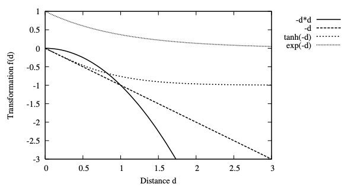
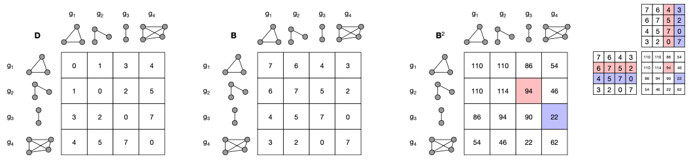

- graph kernel functions are valid [[kernel functions]] $\kappa : \mathcal{G} \times \mathcal{G} \rightarrow \mathbb{R}$ that reflect the similarity of two graphs
  title:: graph kernel function
- derive graph kernels from dissimilarity measures
	- take existing graph dissimilarity measures (e.g., graph edit distance) and turn them into similarity measures
	- trivial indefinite kernels
		- use of indefinite kernels proved useful in practice, even though they lack mathematical properties
		- $\kappa_1(g, g') = -d(g, g')$
		- $\kappa_2(g, g') = -d(g, g')^2$ (similar to polynomial kernel with $c = 0$ and $d = 2$)
		- $\kappa_3(g, g') = \tanh (-d(g, g'))$ (similar to sigmoid kernel)
		- $\kappa_4(g, g') = \exp (-d(g, g'))$ (similar to RBF kernel)
		- 
	- diffusion kernels
		- can turn arbitrary similarity measures into a kernel matrix (which satisfies the conditions of valid kernels)
			- base similarity measure needs to be symmetric
			- similarity measures are larger than zero
		- Given a decay factor $0 < \lambda < 1$, ...
			- ... the exponential diffusion kernel is defined by
			  $$
			  K = \sum_{k = 0}^\infty \frac{1}{k!} \lambda^k B^k = \exp{(\lambda B)}
			  $$
			- ... the von Neumann diffusion kernel is defined by
			  $$
			  K = \sum_{k = 0}^\infty \lambda^k B^k
			  $$
			- both diffusion kernels are positive definite
			- in practice: compute only the first $t$ summands
				- motivation: since $\lambda < 1$, the weighting factor $\lambda^k$ will be negligibly small for sufficiently large $k$
				- resulting matrix is not necessarily positive definite
				- appropriate value for $t$ is determined empirically
		- construction of similarity matrix $B$
			- approach: relative to highest dissimilarity among all graphs
				- Let $\{g_1, \dots, g_n\} \subseteq \mathcal{G}$ be a set of graphs and let $d(g_i, g_j)$ denote a graph distance between $g_i$ and $g_j$. The distance between graphs ${g_1, \dots, g_n}$ can be turned into a matrix $B = (b_{ij})_{n \times n}$ of non-negative similarities, as follows
				  $$
				  b_{ij} = \max_{1 \leq s, t \leq n} (d(g_s, g_t)) - d(g_i, g_j) \quad \text{for } 1 \leq i, j \leq n
				  $$
				- in conjunction with diffusion kernels: considers not only distance of two graphs but also the number of similar graphs they have in common
					- a cell in $B^k$ with $k > 1$ can be interpreted as a similarity measure for a set of graphs
					- consider $(b^2)_{ij} = \sum_{r = 1}^n b_{ir}b_{rj}$
						- large values indicate that there are many graphs $g_r \in \{g_1, \dots, g_n\}$ that are similar to both $g_i$ and $g_j$
				- 
					- $D$: original distance function (dissimilarity function)
					- $B$: similarity function; obtained by considering difference between distance and highest observed distance
					- $B^2$: square of $B$; illustrates how every cell now describes similarity of a set of graphs
					-
				- LATER only works for limited graph domains, no?
					- What about online processing
- prominent graph kernel functions
	- [[convolution kernel]]
	- [[cyclic pattern kernel]]
	- [[subgraph kernel]]
	- [[graphlet kernel]]
	- [[optimal assignment kernel]]