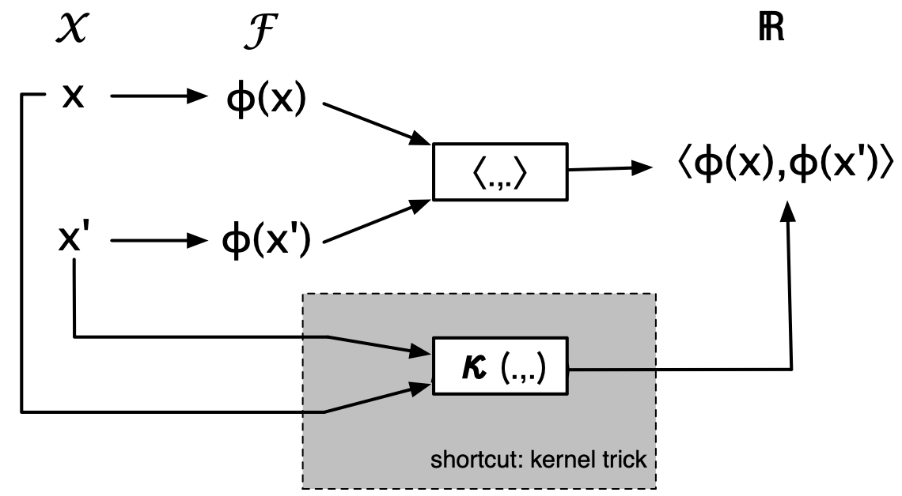

- graph kernel functions (aka. graph kernels) provide an implicit embedding of the domain of graphs into an inner product space
  title:: kernel functions
	- as with [[graph embedding]]s, such an embedding eliminates the lack of mathematical structure in the domain of graphs
		- in other words: makes traditional approaches on real vector spaces applicable to graphs
- definition
	- Let $\chi$ be a pattern space. A kernel function $\kappa : \chi \times \chi \rightarrow \mathbb{R}$ is a symmetric function (i.e., $\kappa(x_i, x_j) = \kappa(x_j, x_i)$) mapping pairs of patterns $x_i, x_j \in \chi$ to real numbers
	- A kernel function $\kappa$ is called positive definite if, and only if, it holds that
	  $$
	  \sum_{i, j = 1}^N c_i c_j \kappa(x_i, x_j) \geq 0
	  $$
	  for all $N \in \mathbb{N}$, for all $\{c_1, \dots, c_N\} \subseteq \mathbb{R}$, and any choice of $N$ objects $\{x_1, \dots, x_N\} \subseteq \chi$
		- also referred to as valid kernels, admissible kernels, or Mercer kernels
		- sometimes also referred to as positive-semidefinite as we allow the term of the left-hand side to be zero
		- (requires that, regardless of the choice of coefficients, the overall sum is non-negative)
- desirable properties
	- expressive
		- reflects the similarity of two graphs
	- permutation-invariant
		- kernel value of two graphs $g$ and $g'$ is identical to value of graphs $h$ and $h'$ if $g \cong h$ and $g' \cong h'$
	- efficient to compute
		- polynomial time complexity
	- positive definite (i.e., valid)
		- grounds kernel in theory; but even non-valid graphs may perform well in practice
	- applicable to a wide range of graphs
- prominent kernels
	- linear kernel
		- $\kappa_{\langle \rangle}(x, x') = \langle x, x' \rangle$
		- no parameters
		- valid kernel
			- dot product is symmetric
			- positive definite as it holds that 
			  $$
			  \sum_{i, j = 1}^N c_i c_j x_i^T x_j \\
			  = (\sum_{i = 1}^n \alpha_i x_i)^T (\sum_{j = 1}^n \alpha_j x_j) \\
			  = || \sum_{i = 1}^n \alpha_i x_i ||^2
			  $$
				- note that $\langle a, b \rangle + \langle x, y \rangle = a_1 b_1 + a_2 b_2 + x_1 y_1 + x_2 y_2 = \langle a + b, x + y\rangle$
				- squared norm is always non-negative
	- RBF kernel
		- $\kappa_{rbf}(x, x') = \exp(- \gamma \bullet ||x - x'||^2)$
		- parameters
			- $\gamma > 0$
		- valid kernel
	- polynomial kernel
		- $\kappa_{\text{poly}}(x, x') = (\langle x, x' \rangle + c)^d$
		- parameters
			- $d \in \mathbb{N}$
			- $c \geq 0$
		- valid kernel
	- sigmoid kernel
		- $\kappa_{\text{sig}}(x, x') = \tanh{(\alpha \bullet \langle x, x' \rangle + \beta)}$
		- parameters
			- $\alpha > 0$
			- $\beta < 0$
		- not necessarily valid kernel
		- behaves similarly to RBF kernel if $\beta$ is small enough and $\alpha$ is close to zero
- kernel trick
	- 
	- kernel functions map objects to real values which represent the scalar product in some Hilbert space
		- Let $\kappa : \chi \times \chi \rightarrow \mathbb{R}$ be a valid kernel on a pattern space $\chi$. There exists a possibly infinite-dimensional Hilbert space $\mathcal{F}$ and a mapping $\phi : \chi \rightarrow \mathcal{F}$ such that
		  $$
		  \kappa(x, x') = \langle \varphi(x), \varphi(x') \rangle
		  $$
		  for all $x, x' \in \chi$ where $\langle \bullet, \bullet \rangle$ denotes the dot product in $\mathcal{F}$
		- Hilbert space is a vector space $\mathcal{F}$ that is endowed with a dot product $\langle \bullet, \bullet \rangle : \mathcal{F} \times \mathcal{F} \rightarrow \mathbb{R}$. The norm induced by that space's dot product (i.e., $||v|| := \sqrt{\langle v, v \rangle}$) must give a complete metric space
	- mapping $\phi : \chi \rightarrow \mathcal{F}$ is not necessarily linear
		- mapping is implicit
		- individual embeddings are not known in general, but only pairwise kernel values
			- resulting Hilbert space may not be known, not even its dimensionality
	- higher-dimensional feature spaces are helpful as they may turn non-linear regularities into linear ones (i.e., non-linear data in original space becomes linearly separable in higher-dimensional space)
		- Cover's theorem: Given is an n-dimensional pattern space $\chi$ and $N$ points $\{x_1, \dots, x_N\} \subseteq \chi$ in general position. If $N \leq n + 1$, all $2^N$ are possible in $\chi$. If $N > n + 1$, the number of linear separations amounts to
		  $$
		  2 \sum_{i = 0}^n \binom{N - 1}{1}
		  $$
	- allows computation of operations that are not available in original vector space and can be expressed in terms of a dot product
- kernel machines
	- algorithms which can be formulated entirely in terms of dot products
		- allows transformation into alternative algorithm by replacing dot product with kernel
		- allows computation to be performed in an implicitly existing feature space $\mathcal{F}$ without computing the mapping $\phi : \mathcal{G} \rightarrow \mathcal{F}$
	- examples
		- support vector machines (SVMs)
		- angle between graphs
		  $$
		  \begin{align*}
		  \angle(g, g') &= \arccos{\frac{\langle \phi(g), \phi(g') \rangle}{|| \phi(g) || \bullet || \phi(g') ||}} \\
		  &= \arccos{\frac{\kappa(g, g')}{\sqrt{\kappa(g, g) \kappa(g', g')}}}
		  \end{align*}
		  $$
- kernel matrix
	- Given a graph kernel $\kappa$ and a set of $n$ graphs $\{g_1, \dots, g_n\} \subseteq \mathcal{G}$, we can form a $n \times n$ kernel matrix
	  $$
	  K = \begin{bmatrix}
	  \kappa_{11} & \kappa_{12} & \dots & \kappa_{1n} \\
	  \kappa_{21} & \kappa_{22} & \dots & \kappa_{2n} \\
	  \vdots & \vdots & & \vdots \\
	  \kappa_{n1} & \kappa_{n2} & \dots & \kappa_{nn} \\
	  \end{bmatrix}
	  $$
	  where  $\kappa_{ij}$ refers to the kernel function $\kappa (g_i, g_j)$
	- kernel functions are positive definite and therefore represent valid kernel functions