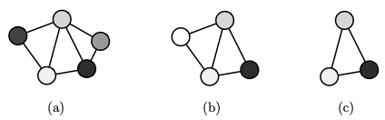

- commonly used as a similarity measure of one graph with some other graph
	- tolerates deviations even within a substructure (as opposed to [[subgraph isomorphism]]s)
		- 
		- there is no subgraph isomorphism from b) to a) (and vice versa) since both contain one node that the other doesn't contain
			- subgraph isomorphism requires one graph to be fully contained in the other
- intuition
	- constraints of (subgraph) isomorphisms are strict which make them rather bad similarity measures
	- idea: consider subgraphs of both graphs instead of requiring that one graph is fully contained by the other
		- "intersection" of two graphs that is identical in terms of structure and labels
- definition
	- Let $g_1$ and $g_2$ be graphs. A graph $g$ is called a common subgraph of $g_1$ and $g_2$ if there exists subgraph isomorphisms from $g$ to $g_1$ and from $g$ to $g_2$. The largest common subgraph with respect to the cardinality of nodes $|V|$ is referred to as a maximum common subgraph (mcs) of $g_1$ and $g_2$
	- maximum common subgraph is not necessarily unique
- recognition algorithms
	- [[association graph-based maximum common subgraph search]]
- related distance functions
	- normalized by size of maximum graph
		- $d_{MCS}(g_1, g_2) = 1 - \frac{|mcs(g_1, g_2)|}{\text{max}\{|g_1|, |g_2|\}}$
	- normalized/weighted by size of graph union
		- $d_{WGU}(g_1, g_2) = 1 - \frac{|mcs(g_1, g_2)|}{|g_1| +|g_2| - |mcs(g_1, g_2)|}$
		- union in the set-theoretic sense
			- union contains set of unique vertices
			- size of union is exactly $|g_1| = |g_2|$ in case $g_1 \cong g_2$
		- also considers size of smaller graph
			- compare with $d_{MCS}$: $d_{MCS}$ does not change if we add another node to the smaller subgraph that isn't contained in the most common subgraph
	- unnormalized with graph union:
		- $d_{UGU}(g_1, g_2) = |g_1| + |g_2| - 2 \bullet |mcs(g_1, g_2)|$
		- unnormalized metric, but metric is still zero in case $g_1 \cong g_2$ (wouldn't be a distance otherwise)
	-