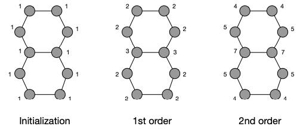

- definition
	- The Morgan index is computed iteratively. Initially, the Morgan index for all nodes $u \in V$ is defined as $M_0(v) = 1$. The $k$th order Morgan index fro all nodes $u \in V$ (with $k > 0$) is then defined by
	  $$
	  M_k(u) = \sum_{v \in \mathcal{N}(u)} M_{k - 1}(v)
	  $$
	- that is, $M_k(u)$ is the sum of all Morgan indices from the last round of $u$'s adjacent nodes in $v \in \mathcal{N}(u)$
- can be run for a specified number of iterations or until convergence
- example
	- {:height 224, :width 503}