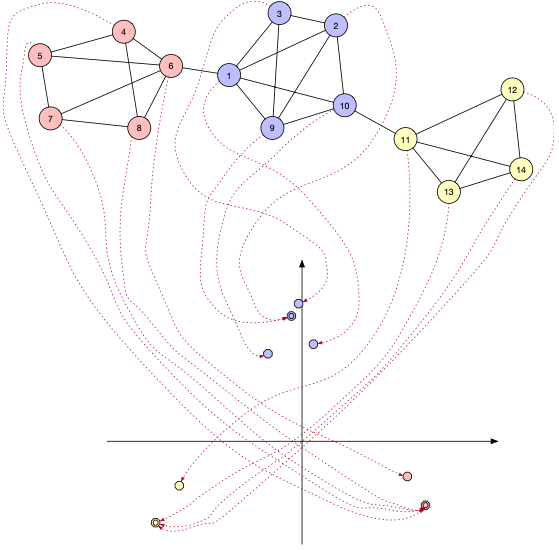

- A graph [[embedding]] $f : V \rightarrow \mathbb{R}^d$ maps each vertex $u \in V$ of some graph $g = (V, E)$ to a $d$-dimensional vector $z_u \in \mathbb{R}^d$ in a real vector space
	- 
	- low-dimensional vector spaces are generally preferable
		- can reduce computational complexity as connectivity of graphs is typically high-dimensional
	- allows application of operators proper to real vector spaces on graphs
		- spans gap between structural and statistical [[pattern recognition]]
- challenges
	- embedding $f$ should be defined such that similarity of nodes in the embedding space $\mathbb{R}^d$ approximates similarity of nodes in the original graph $g = (V, E)$
		- preserve structural and relational properties of nodes
		- preserve communities and roles of nodes (within communities)
		- ideally: $s(u, v) \approx \langle z_u, z_v \rangle$
			- dot product is considered standard similarity measure in $\mathbb{R}^d$
			- any other similarity measure in $\mathbb{R}^d$ would work as well
			- $s$ has natural definitions for labeled graphs but not for unlabeled graphs
- taxonomy
	- supervised vs. unsupervised
		- unsupervised does not require ground-truth embeddings
	- operating on labeled or unlabeled graphs
		- labels of labeled graphs are typically specific to a task  (e.g., graph clustering or node classification)
		- unlabeled graphs are not specific to any tasks
			- no standard measure of similarity without labels
- criteria
	- smoothness criterion
	  id:: 67ef7a78-1e73-4492-b613-de8c601b66b1
		- definition
			- Let $g = (V, E)$ be a graph, $A$ the adjacency matrix of $g$, $f: V \rightarrow \mathbb{R}^d$ a node embedding, and $z_i, z_j \in \mathbb{R}^d$ the embeddings of the $i$-th and $j$-th node of $g$ according to $f$, respectively. The smoothness of $f$ is given by
			  $$
			  \mathcal{Q}(f) = \frac{1}{2} \sum_{i, j} a_{ij} ||z_i - z_j||^2
			  $$
		- intuition
			- two nodes $u_i \in V$ and $u_j \in V$ that are structurally similar in the graph (same community or frequently interacting) have embeddings that align closely in $\mathbb{R}^d$
				- core operation is only applied pairwise
					- since the embedding of a node $v$ should be close to all of its neighbors $\mathcal{N}(v)$, any such neighbor $u \in \mathcal{N}(v)$ indirectly needs to be close to all other neighbors $w \in \mathcal{N}(v)$ as well (even if $u$ and $w$ are not adjacent)
				- embeddings of structurally similar nodes yield high dot product $\langle z_i, z_j \rangle$ and thus high cosine similarity $s_{cos}(z_i, z_j)$
- representation
  id:: 67ef9376-afce-44be-9d75-e7ff34042c22
	- any node embedding $f : V \rightarrow \mathbb{R}^d$ can be interpreted as a matrix $Z \in \mathbb{R}^{|V| \times d}$
		- every row maps one vector in $V$ to its embedding
		- embedding of $v$ can be obtained through indicator (row) vector $\mathbb{I}^{|V|}$
			- $f(v_i) = \mathbb{I}^{|V|} \bullet Z$
			- indicator vector is vector which components are all zero except at position $i$ indicating the index of node $v_i$
- variants
	- [[spectral node embedding]]
		- does not require node labels
			- not specific to a specific task (e.g., graph clustering or node classificatoin)
	- [[node2vec]]
		- does not require node labels
		- unsupervised