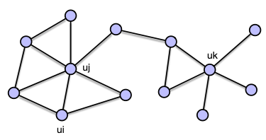

- fundamental ways to construct measures of node similarity
	- [[structural equivalence]]
	- [[regular equivalence]]
- example
	- 
	- nodes $ui$ and $uj$ are part of the same community and therefore _structurally equivalent_
	- nodes $ui$ and $uk$ both act as hubs of their corresponding communities and are thus _regularly equivalent_