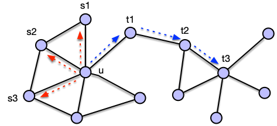

- formulates problem of defining a [[node embedding]] $f: V \rightarrow \mathbb{R}^d$ as a maximum likelihood optimization problem
- intuition
	- random walk
		- let $g = (V, E)$ be a graph and $u \in V$ a starting node in $g$
		- random walk iterator selects one direct neighbor of the current node at random, transitions to it, and appends that node to its current walk
			- repeat fixed number of times
			- resulting walk is then referred to as a random walk on $g$
	- encounter probability
		- given $g = (V, E)$, a starting node $u \in V$ and a random walk strategy $R$, the probability of visiting some node $v \in V$ is referred to as
		  $$
		  P_R(v | u)
		  $$
	- choose embedding such that dot product $\langle z_u, z_v \rangle$ of two node embeddings $z_u$ and $z_v$ is similar to probability $P_R (v | u)$
		- embeddings are similar if corresponding nodes $u$ and $v$ are likely to occur together during random walk through the graph (starting from one of the two nodes)
	- motivation of using random walks over other randomized similarity measures as objective
		- incorporates local and higher-order neighborhood information
		- efficient as not all pairs of nodes but only co-occurring nodes are considered
			- determining random walks starting from every node is only of complexity $\mathcal{O}(N)$
- sampling random walks
	- for every node $u \in V$, run short and fixed-length random walks starting from $u$ using random walk strategy $R$
		- nodes visited during random walks are collected in multi-set $\mathcal{N}_R(u)$ (allows duplicates)
		- length of random walk is fixed to some parameter $k \in \mathbb{N}$
	- problem of generating neighborhoods $\mathcal{N}_R(u)$ of node $u \in V$ can be seen as a local search problem
	- random walk strategies
		- 
		- breadth-first search (BFS)
			- restricted to nodes which are close to the source (mostly immediate neighbors of source depending on choice of $k$)
			- microscopic view of neighborhood; characterizes local neighborhoods
		- depth-first search (DFS)
			- sampled nodes may be of increasing distances
				- not necessarily, as we could consider a neighbor of the source by chance
				- in extreme case, depth-first search may remain in immediate neighborhood if source node is part of a clique with at least $k$ other nodes
			- macroscopic, global view of neighborhood
		- node2vec's flexible strategy
			- interpolates smoothly between DFS and BFS based on parameters
			- 2nd-order random walk strategy
			- parameters
				- return parameter ($p$)
					- likelihood of immediately revisiting a node in the walk
					- high probability if $p > \max(q, 1)$; low probability if $p < \min(q, 1)$
				- in-out parameter ($q$)
					- likelihood of selecting a node close to the previously visited node
					- high values ($q > 1$) imply bias towards close nodes; low values ($q < 1$) imply bias towards distant nodes
					- interpolates DFS and BFS
			- Consider that we just sampled the edge $(t, v)$. The probability $p(v \rightarrow x)$ of traversing edge $(v, x)$ is defined by
			  $$
			  p(v \rightarrow x) = \begin{cases}
			  \frac{1}{p} & \text{if } d(t, x) = 0 \quad (\text{i.e., t = x}) \\
			  1 & \text{if } d(t, x) = 1 \\
			  \frac{1}{q} & \text{if } d(t, x) = 2 
			  \end{cases}
			  $$
				- That is, if we probe a neighbor of $t$, we immediately traverse the edge. Otherwise, we only traverse it with a certain probability. If we don't traverse it, we probe the next neighbor of the current node
- optimizing embedding
	- optimize embedding $f: V \rightarrow \mathbb{R}^d$ such that the log-probability of observing a neighborhood $\mathcal{N}_R(u)$ for a node $u$ is maximized
		- objective function
		  $$
		  \max_f \sum_{u \in V} \log P(\mathcal{N}_R (u) | z_u)
		  $$
		  or equivalently
		  $$
		  \mathcal{L} = \min_f \sum_{u \in V} \sum_{v \in \mathcal{N}_R (u)} - \log (P(v | z_u))
		  $$
		  with $\mathcal{L}$ representing the optimal likelihood function. We can expand $P(\mathcal{N}_R (u) | z_u)$ to a sum as the events $P(v | z_u)$ with $v \in \mathcal{N}_R (u)$ are the elementary events that make up the composite event
		- we want to interpret dot products on learned embedding vectors as probability functions
			- scalar products are not probability functions per-se
				- e.g., scalar product for all possible outcomes with respect to a node $z_u$ don't necessarily add up to 1
			- translate output values of scalar product to probability using softmax
			  $$
			  \mathcal{L} = \min_f \sum_{u \in V} \sum_{v \in \mathcal{N}_R (u)} - \log \left( \frac{\exp(\langle z_u, z_v \rangle)}{\sum_{w \in V} \exp (\langle z_u, z_w \rangle)} \right)
			  $$
		- normalization term of softmax is expensive to compute as it requires iteration over all of the graph's nodes
			- idea: approximate softmax through sigmoid function
				- sigmoid function $\sigma(x) = \frac{1}{1 + e^{-x}} = \frac{e^x}{1 + e^x}$ can be used to map arbitrary values to probabilities in binary classification problems
				- softmax comes close to sigmoid if logits of one class are significantly larger than those of another
				- only considers a simple sample and not set of all samples
			- approximation
			  $$
			  \log \left( \frac{\exp(\langle z_u, z_v \rangle)}{\sum_{w \in V} \exp (\langle z_u, z_w \rangle)} \right) \approx \log(\sigma(\langle z_u, z_v \rangle))
			  $$
				- suffers from problem that value can be arbitrarily increased by increasing parameter
				- normalization term over all parameters held arbitrary parameter growth in check
				- idea: negative sampling
					- introduce additional negative term that ensures that probability for dissimilar nodes is low
					  $$
					  \log \left( \frac{\exp(\langle z_u, z_v \rangle)}{\sum_{w \in V} \exp (\langle z_u, z_w \rangle)} \right) \approx \log(\sigma(\langle z_u, z_v \rangle)) - \sum_{i = 1}^k \log (\sigma (\langle z_u, z_{w_i}\rangle))
					  $$
					- sum in approximation only subset of nodes of size $k$
						- can be picked with probability proportional to their degree
						- $k$ typically between 5 and 20 in practice
					- LATER How to find dissimilar nodes?
		- results in final objective function
		  $$
		  \mathcal{L} = \min_f \sum_{u \in V} \sum_{v \in \mathcal{N}_R (u)} - \log(\sigma(\langle z_u, z_v \rangle)) - \sum_{i = 1}^k \log (\sigma (\langle z_u, z_{w_i}\rangle))
		  $$
	- parameters are embedding vectors (or rather coordinates of embedding vectors)
	- parameters can be optimized using gradient descent
		- for large graphs: stochastic gradient descent which samples one node in every iteration