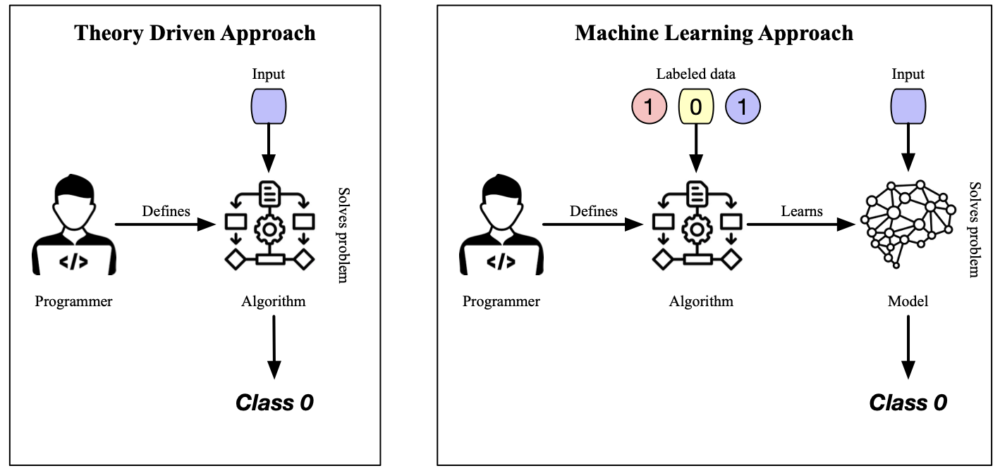

- assign a class $y$ to a pattern $x$
	- notation
		- $f_\theta (x) = y$ with $x \in X$, $y \in Y$
		- $X$ is domain of abstract pattern representation, typically $\mathbb{R}^n$
		- $Y$ is finite label set, typically small
		- $\theta$ is class model
	- derivation of representation of $X$ often requires deep domain knowledge
	- distinction between statistical and structural pattern recognition based on representation of features
		- statistical pattern recognition: derive patterns from feature vectors
			- notation
				- $X$ is vector space $\mathbb{R}^n$
				- $\theta$ are learned class boundaries in $\mathbb{R}^n$
			- many operations are available on vector space
			- used for classification
			- limitations
				- all vectors have to preserve the same length, regardless the size or complexity of the underlying data
				- not possible to express (mostly binary) relationships between parts of the data
		- structural pattern recognition: derive patterns using structural properties of symbolic representation
			- notation
				- $X$ is structured data such as strings and graphs
				- $\theta$ is set of known, prototypical patterns that can be tested against element to be classified
			- limitations
				- available operations
					- often no clear notion of operations that are common in other representations
						- how to define the distance between any two graphs?
						- how to define aggregations (e.g., sum, mean) on a collection of graphs?
				- common approaches to comparison (e.g., identifying common parts of graph by considering all subsets of nodes) are complex
			- used for classification and analysis
- different from ...
	- pattern analysis
		- provide a general description of the pattern
	- regression
	- unsupervised learning (notably clustering)
- relates to ...
	- image analysis
		- e.g., preprocessing, segmentation, representation
	- pattern recognition
		- e.g., classification, analysis
	- artificial intelligence
		- e.g., search algorithms, learning algorithms
- implementation approaches
	- 
	- theory-driven approach
		- developer specifies algorithm that solves problem directly
	- machine learning-based approach
		- developer specifies algorithm that learns how to solve the problem from examples