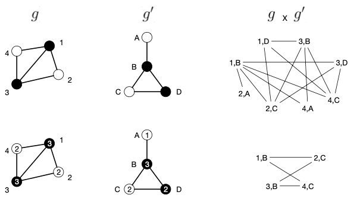

- define similarity of graphs based on number of matching pairs of random walks in two graphs
	- can be calculated without having to enumerate all possible random walks in the two graphs
		- makes it feasible to consider random walks of arbitrary length
		- number of possible walks of length $n$ is given by $n$th power of the adjacency matrix of the corresponding [[direct product graph]]
- definition
	- Given a weighting parameter $\lambda \geq 0$, the random walk kernel for graphs $g$ and $g'$ is defined by
	  $$
	  \kappa_{RW}(g, g') = \sum_{i, j = 1}^{|V_\times|} \left[ \sum_{n = 0}^\infty \lambda^n A_\times^n \right]_{ij}
	  $$
	  where $A_\times$ is the adjacency matrix of the direct product $(g \times g')$
		- can also be expressed as
		  $$
		  \kappa_{RW}(g, g') = \sum_{i, j = 1}^{|V_\times|} \left(I - \lambda A_\times\right)_{ij}^{-1}
		  $$
		  since limit of a series $I + \lambda^1 A^1 + \lambda^2 A^2 + \dots$ is given by $(I - \lambda A)^{-1}$
	- weight $\lambda$ is typically smaller than $1$
		- makes contribution of $\lambda^n A_\times^n$ insignificant for large $n$
		- sufficient to consider a finite number of addends $t$ only
	- LATER Not a convolution kernel, no? Only modified random walk graph kernel is, right?
- intuition
	- inner sum yields matrix in which every cell $a_{ij}$ indicates the number of possible paths of arbitrary length between the nodes corresponding to nodes $i$ and $j$
		- per-cell sum is weighted, so cell only contains weighted sum rather than exact amount
	- outer sum adds up the values of all cells
	- overall expression yields a scalar, just as any other [[graph kernel function]]
- complexity
	- determine direct product graph
		- contains at most $n^2$ nodes, where $n = \max(|V|, |V'|)$
	- invert adjacency matrix of direct product graph
		- inversion of $x \times x$ matrix requires $\mathcal{O}(x^3)$ time
		- since number of nodes (and hence dimension of adjacency matrix) is bound by $n^2$, inversion is bound by $\mathcal{O}(n^6)$
	- optimizations
		- computation of random walk kernel can be reformulated as sylvester equation, which can be solved in $\mathcal{O}(n^3)$
		- introduce additional labels
			- computation of random walk kernel directly depends on size of direct product graph
			- size of direct product graph _generally_ depends on number of labels, with a larger number of labels _generally_ yielding smaller direct product graphs
			- introduce topological descriptors of nodes as labels, such as [[morgan index]]
				- Morgan index can be run for a fixed number of iterations; not necessary to run til convergence
				- example
					- 
					- reduces product graph from 8 nodes down to 4
			-
		-