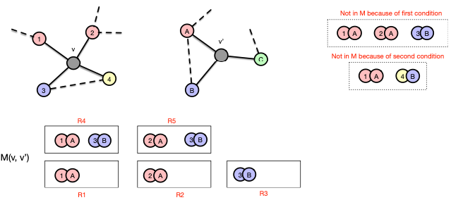

- intuition
	- for two roots $v \in V$ and $v' \in V'$, we can count the number of matching [[subtree pattern]]s that are rooted at these nodes
		- LATER Isn't there an infinite amount of subtree patterns? Is this why we introduce a decay factor?
	- count patterns over all possible pairs of roots
- necessary abstractions
	- $R \subset \mathcal{N}(v) \times \mathcal{N}(v')$
		- following two conditions must hold
			- $\forall(u, u'), (w, w') \in R : u = w \Leftrightarrow u' = w'$
				- ensures that every node is assigned to at most one other node
			- $\forall(u, u') \in R : \mu(u) = \mu(u')$
		- contains matchings of nodes in neighborhood
	- $\mathcal{M}(v, v') = \{R \subseteq \mathcal{N}(v) \times \mathcal{N}(v') \}$
		- contains all possible matchings of nodes in neighborhood
		- example
			- 
			- list of excluded sets is not exhaustive
- definition
	- The subtree kernel with subtree height $h$ that compares all pairs of nodes from graphs $g = (V, E, \mu)$ and $g' = (V', E', l)$ by iteratively comparing their neighborhoods is defined as follows
	  $$
	  \kappa_{\text{subtree}, h}(g, g') = \sum_{v \in V} \sum_{v \in V'} = \kappa(v, v', h)
	  $$
	- with inner kernel defined as
	  $$
	  k(v, v', h) = \begin{cases}
	  \delta(\mu(v), \mu(v')) & \text{if } h = 1 \\
	  \lambda \delta(\mu(v), \mu(v')) \sum_{R \in \mathcal{M}(v, v')} \prod_{(w, w') \in \mathcal{R}} k(w, w', h - 1) & \text{if } h > 1
	  \end{cases}
	  $$
		- $\delta$ is indicator function yielding 1 if its arguments are equal, and 0 otherwise
			- discard entire subtree if one node doesn't match
		- $\lambda$ is decay factor
		- the fact that we don't consider the previously visited nodes is the reason why we consider subtree patterns and not only subtrees
- complexity
	- computing kernel for a pair of graphs: $\mathcal{O}(n^2 h 4^d)$
		- $d$ denotes maximum degree
		- comparison of all pairs of nodes: $n^2$
		- pairwise comparison of all matchings in their neighborhoods: $\mathcal{O}(4^d)$
		- repetitions with dynamic programming: $h$ (exponential in $h$ otherwise)