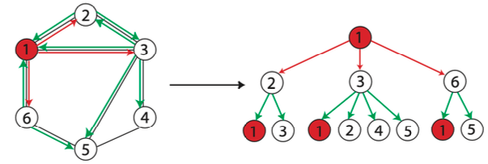

- extends notion of subtrees
	- subtree that allows for duplicate nodes and edges
		- subtree pattern is translated into a single subtree
		- multiple occurrences of the same node are translated into separate nodes in the subtree
	- similar to how walks extend the notion of paths
- also known as tree walks
- example
	- 
	- subtree pattern of height 2 rooted at the node $1$