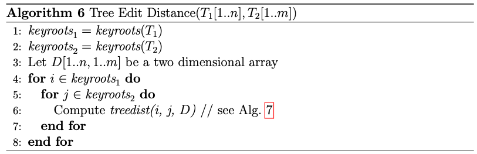
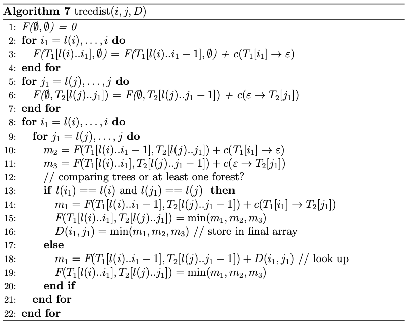
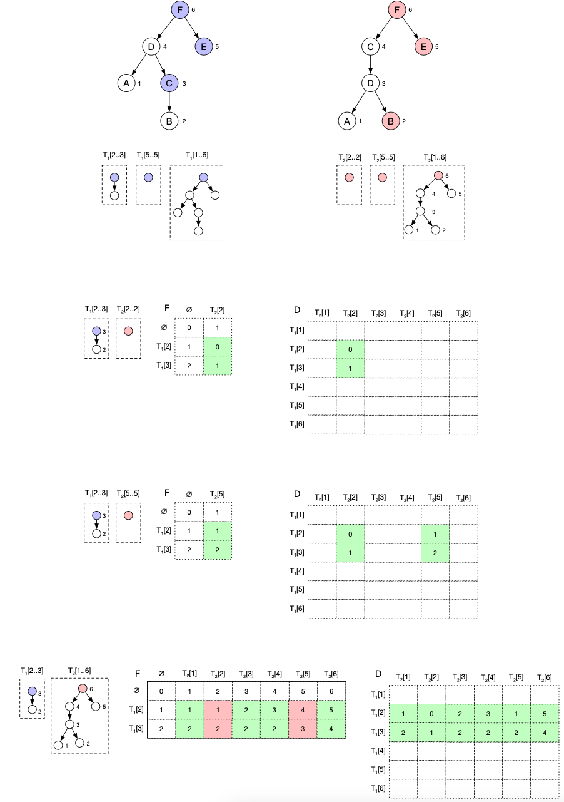

- motivation: restrict graphs to specific classes of graphs to enable use of more efficient algorithms
- notation
	- nodes are indexed according to post-order traversal order
	- $T[i]$ to denote individual node, $T[i..j]$ to denote range of nodes
		- range of nodes may include nodes of separate trees (e.g., since common parent is not included in range)
		- if $j > i$, the expression yields the empty set
	- $l(i)$ denotes the left-most leaf descendant of the subtree rooted at $T[i]$
	- $p(i)$ denotes the parent node of $T[i]$
		- $p^k(i)$ for k-th ancestor
- edit operations
	- node edit operations
		- substitution
			- substituting node $T[i]$ means changing the corresponding node's label
			- notation: $(T_1[i] \rightarrow T_2[i])$
		- insertion
			- inserting node $v$ as the child of $T[i]$ makes $v$ the parent of a consecutive subsequence of the current children of $T[i]$
			- notation: $(\varepsilon \rightarrow T_2[j])$
		- deletion
			- deleting node $T[i]$ means removing $T[i]$ and making the children of $T[i]$ become the children of the parent of $T[i]$
			- notation: $(T_1[i] \rightarrow \varepsilon)$
- algorithm
	- 1st step: determine key roots
		- $\text{keyroots}(T) = \{ k | \not \exists k' > k : l(k) = l(k') \}$
			- in other words: node is key root if...
				- ... $T[k]$ is the root node of $T$ or
				- ... $T[k]$ has a left sibling
			- in other words: key roots are all nodes that have no parent that share the same left-most leaf descendant
		- nodes of the subtree with key root $k$ is given by $T[l(k)..k]$
		- set of keyroots as well as the left-most descendant can be determined in linear time
	- 2nd step: construct local and global cost tables
		- overall behavior
			- one local table for every combination of key rooted-subtrees
				- 
				- starts with trees with smallest keyroot index
				- iterates through all subtrees of $T_2$ before passing to the next keyroot index for $T_1$
			- constructs a global graph edit distance table (similar to table calculated for Levenshtein distance) from local tables
		- local tree distance calculation
			- 
			- initialization
				- initialize first column with cost for consecutive deletion of all nodes in $T_1$
				- initialize first row with cost for consecutive insertion of all nodes in $T_2$
				- analogous to initialization of cost table for Levenshtein distance
			- for every possible combination of nodes within the considered subtrees, do the following
				- compute cost of possible edit operations
					- compute the total cost after node deletion ($m_2$)
					- compute the total cost after node insertion ($m_3$)
					- compute the total cost after node substitution ($m_1$)
						- compute actual node substitution cost in the general case
						- look up cost stored in global cost table if the current node in $T_1$ or $T_2$ does not have the same left-most descendant as the respective key root node
							- considered node is part of a separately considered subtree for which no sufficient local information is available
							- operating on a forest and not a single tree (with regard to the node processed in the current operation)
					- all preceding costs are guaranteed to be available due to the order in which the nodes are traversed within a local calculation; and due to the order in which the local calculations are triggered
				- write result into local cost table
				- if the currently considered nodes are not in a separately-considered subtree (i.e., we're in the general case): write result back to global cost table
					- every entry in the global cost table is written at most once, i.e., values are stable
- sample execution
	- 