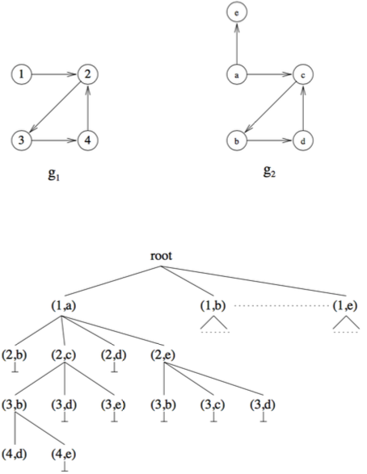

- collection of techniques that use tree search with backtracking to reliable determine whether there exists a subgraph isomorphism between two graphs $g$ and $g'$
- overall strategy
	- every vertex in tree represents one (partial) node matching
	- partial node matching is expanded by one node at a time
	- backtrack if edge structure constraint is violated, or if edge or node labels are inconsistent
	- expand next best partial node matching for which an expansion is still possible
	- selection of next best partial node matching can be optimized through heuristics
	- termination criteria
		- terminate if no further expansion is possible and conclude that there is no subgraph isomorphism between the two graphs
		- terminate if node matching is complete
- sample execution
	- 
- algorithms
	- [[ullman's algorithm for subgraph isomorphism]]
	-