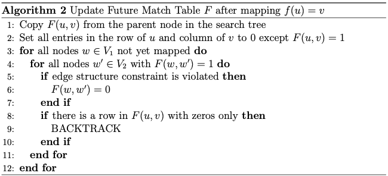
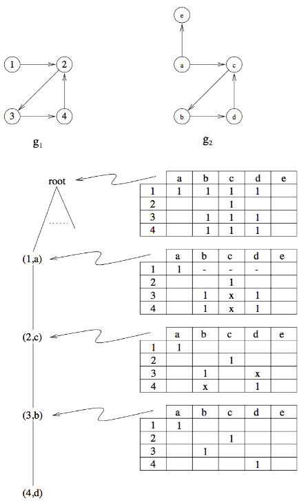

- intuition
	- search up general tree search using a heuristic called _look-ahead technique_
		- uses _future match table_ $F(u, v)$
			- rows correspond to vertices in $V_1$
			- columns correspond to vertices in $V_2$
			- table indicates whether $f(u) = v$ is a possible match
			- table is initialized as
			  $$
			  F(u, v) = \begin{cases}
			  1 &\text{ if } \mu_1(u) = \mu_2(v) \wedge \text{in}(u) \leq \text{in}(v) \wedge \text{out}(u) \leq \text{out}(v) \\
			  0 &\text{otherwise}
			  \end{cases}
			  $$
		- every vertex in search tree contains its own future match table
- implementation
	- expand next best node, i.e., select a node $u$ which should be mapped to some other vertex $v$ (cf. [[tree-based subgraph isomorphism test]])
	- reflect assignment
		- indicates assignment and ensures that $u$ and $v$ are not picked again
		- set all entries in the row for $u$ to zero
		- set all entries in the column for $v$ to zero
		- set entry $F(u, v)$ back to 1
	- reflect implications of assignment on all other vertices
		- test for every unmapped node $w \in V_1$ whether their entries $F(w, w')$ for $w' \in V_2$ still hold
			- possible that the performed mapping makes mapping $f(w) = w'$ impossible (e.g., since $v \sim w'$ but $u \not\sim w$)
			- reflect result of check in cell $(w, w')$
		- if one row contains zeros only, then there is one vertex in $V_1$ that cannot be mapped to any other vertex
			- current node's mapping cannot possibly be an isomorphism
			- backtrack
	- pseudo code
		- 
- sample execution
	- 
	- deletions due to line 2 are indicated using $-$
	- deletions due to line 6 are indicated using $\times$
	- graphs are unlabeled (numbers and letters serve only illustrative purposes)
- variants
	- select node $u \in V_1$ whose row has the least number of ones in $F(u, v)$